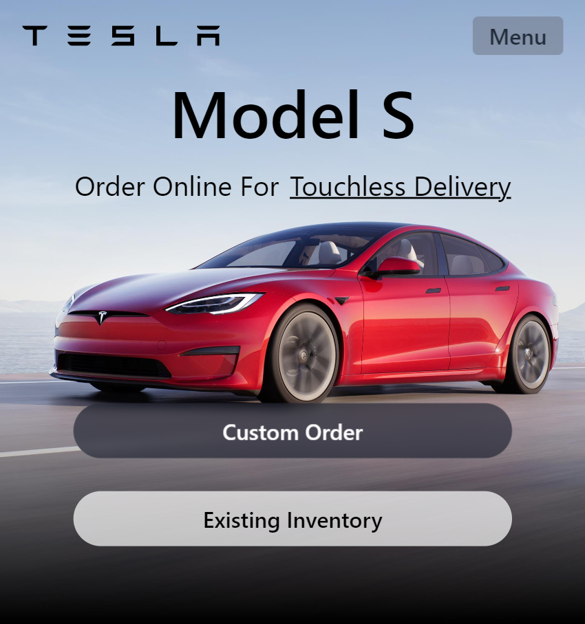
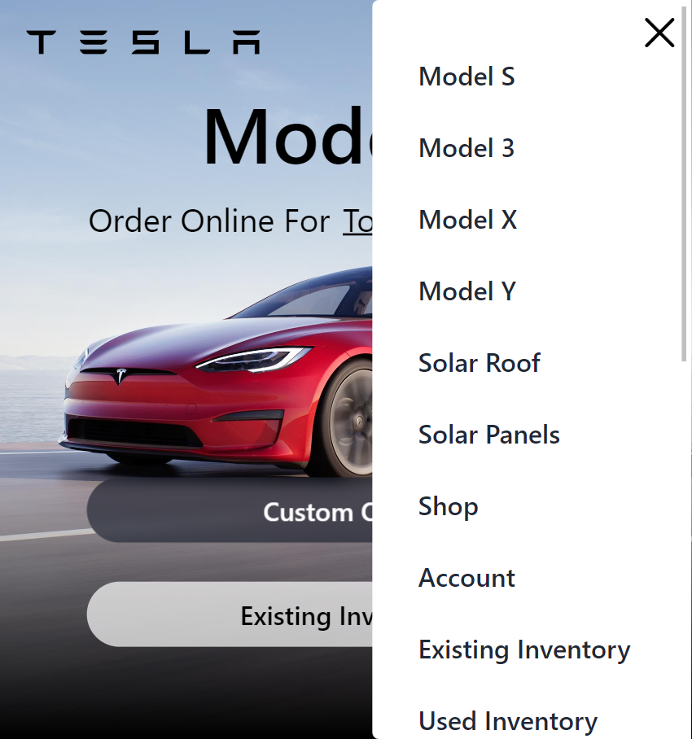
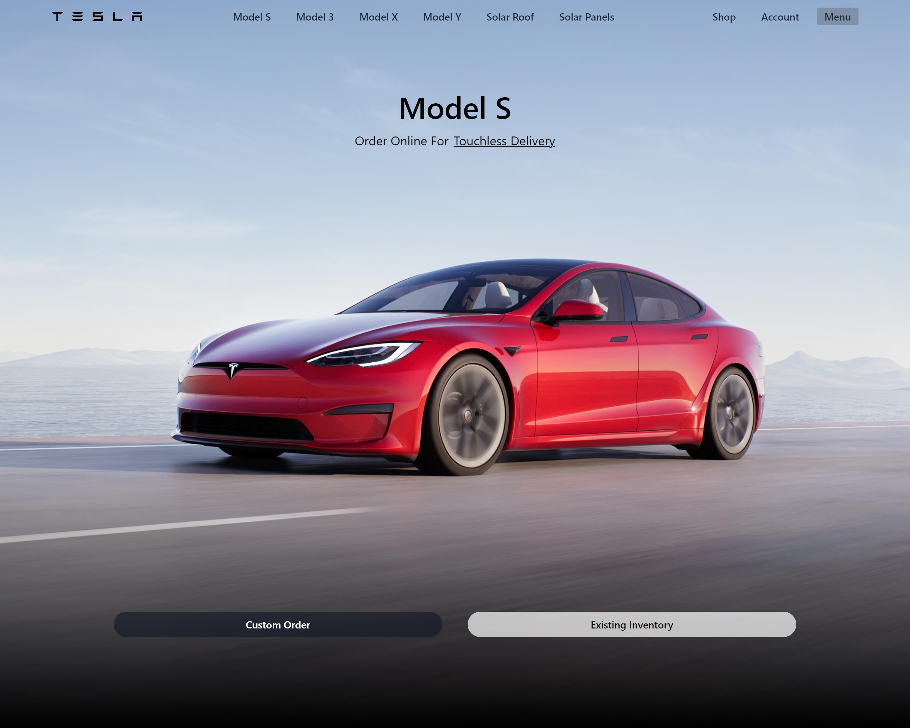
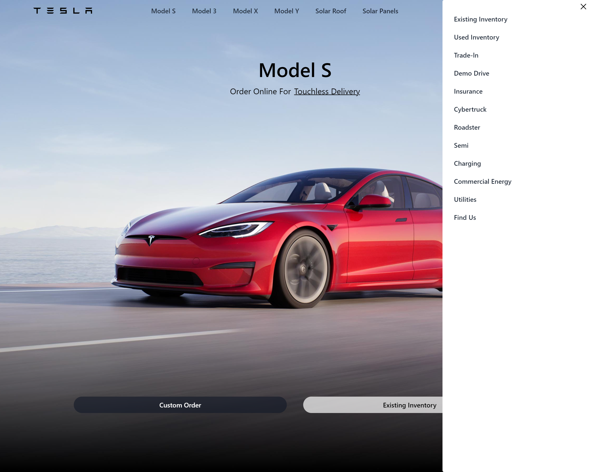

# Tesla home page UI Clone Built Using React

### An functional Tesla UI clone

## Screenshots

### Mobile Screenshot

    
    &ensp; &ensp;

    
    &ensp; &ensp;

### Desktop Screenshot

    
    &ensp; &ensp;

    
    &ensp; &ensp;

### Demo

    
    &ensp; &ensp;

